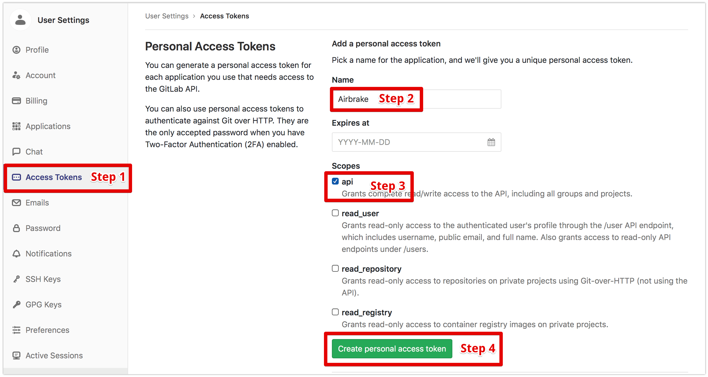

# Gitlab Initiate and execute branch merge request script

1. gitlab create in the code repository private token

2. modify `config.py` configuration

3. modify `python-gitlab` configuration
  
sudo pip install --upgrade python-gitlab

3. execution `python3 main.py`，follow the prompts
